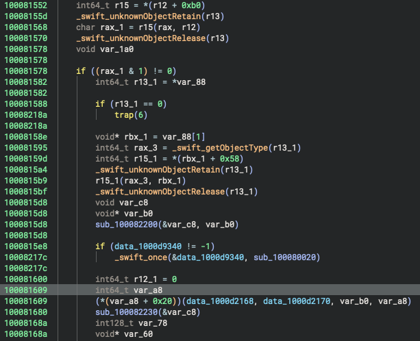
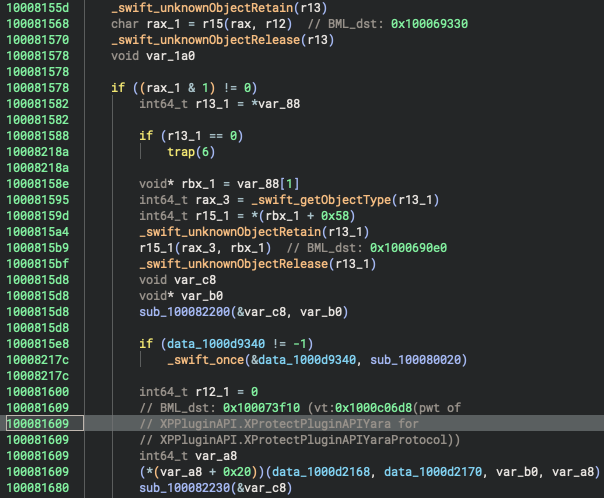
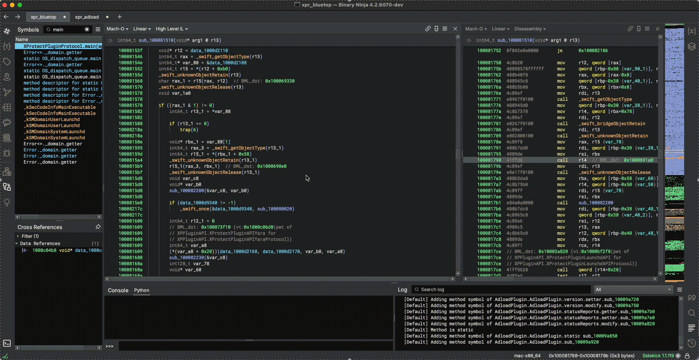

# Binja Missing Link

A Binary Ninja plugin for analyzing indirect branch targets in x86_64 binaries.

## Description

Binja Missing Link is a plugin for Binary Ninja that helps analyze indirect branch targets in x86_64 binaries. It provides detailed information about branch targets, function calls, and virtual table references, making it easier to understand program control flow and function relationships.

### Before applying the Binja Missing Link plugin


### After applying the Binja Missing Link plugin


### Cross reference between branch points


## Features

**Comment Generation**
- Adds detailed comments at branch sources and destinations
- Includes:
    - Target addresses in hexadecimal
    - Function names (when available)
    - Virtual table information (when applicable)
- Supports cross-referencing between branch points

## Usage

1. Load your x86_64 binary in Binary Ninja
2. Run the plugin command "Binja Missing Link"
3. Select the JSON file containing branch tracking information
   - The JSON file can be generated by running the LLDB commands (`brt_set_bps` and `brt_save`) provided by [my LLDB plugin repository](https://github.com/kohnakagawa/LLDB).
4. The plugin will analyze the binary and add comments showing:
   - Branch destinations (BML_dst)
   - Branch sources (BML_src)
   - Virtual table references (when applicable)

### Input Format

The plugin expects a JSON file with the following structure:
```json
{
    "modules": [
        {
            "name": "module_name",
            "addr": "0xbase_address"
        }
    ],
    "branches": [
        {
            "before": {
                "module": "module_name",
                "func": "function_name",
                "registers": {
                    "rip": "0xaddress",
                    // other register values
                }
            },
            "after": {
                "module": "module_name",
                "func": "function_name",
                "registers": {
                    "rip": "0xaddress",
                    // other register values
                }
            }
        }
    ]
}
```

### Test

```bash
# Install pytest
pip install -r test/requirements-test.txt
python3 /Applications/Binary\ Ninja.app/Contents/Resources/scripts/install_api.py --force

# Run tests
pytest test/test_binja_missinglink.py
```

## Author

Koh M. Nakagawa (@tsunek0h) &copy; FFRI Security, Inc. 2025

## License

This plugin is released under an [Apache 2.0 license](./LICENSE).
